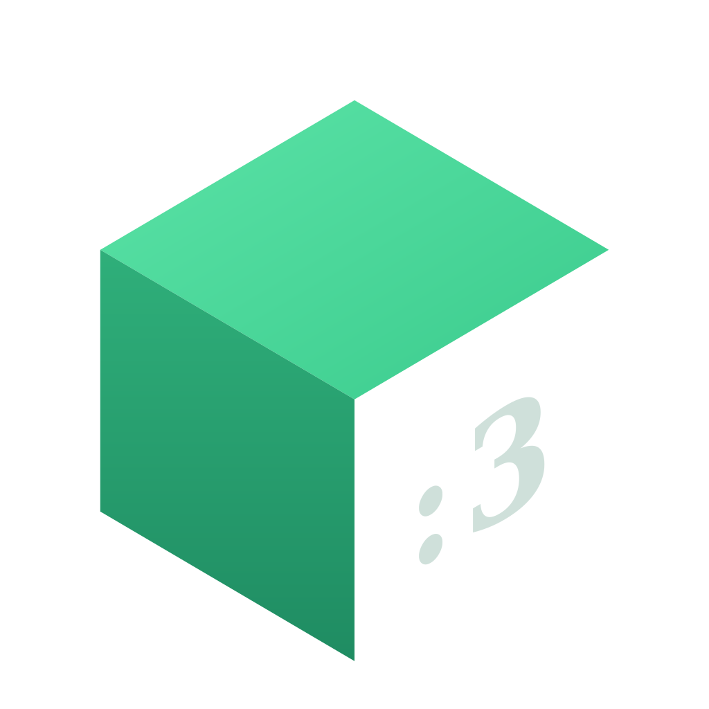

<p align="center">
  
</p>

<h1 align="center">Storify</h1>

<p align="center"><b>Self-hosted inventory management for Flutter, backed by a PHP REST API on MySQL.</b></p>

<p align="center">
  <a href="LICENSE"></a>
  <a href="https://github.com/Cikle/storify/releases/latest"></a>
  
  
</p>

---

> [!IMPORTANT]
> Storify requires a **self-hosted PHP + MySQL backend** to function. The app will not work without it. See [Setup](#setup) to get started.

## Features

- **Inventory management** — add, edit, delete items with name, category, barcode, location, expiry date, unit, pack size, and photo
- **Barcode scanner** — scan to look up or create items instantly via camera
- **Stock control** — inline +/− controls and per-item quantity adjustments
- **Item transfer** — move stock between locations (full or partial)
- **Item photos** — attach camera or gallery photos to items
- **Low-stock alerts** — local push notifications when stock drops below a configurable threshold
- **Expiry tracking** — dashboard cards and banners for expiring and expired items
- **Offline-first** — cached data shown immediately, writes queued locally and synced on reconnect
- **Multi-account** — switch between multiple self-hosted API backends
- **Export** — CSV and PDF inventory reports
- **Import** — bulk restock via CSV upload
- **Dark theme, English/German localization**

## Stack

| Layer | Tech |
|---|---|
| App | Flutter (Dart) |
| State | Provider |
| Backend | PHP 8.x REST API |
| Database | MySQL (InnoDB) |
| Auth | Static API key (`X-Api-Key` header) |
| Barcode | mobile_scanner |
| Export | csv, pdf, printing |

## Requirements

- Flutter SDK 3.6+
- PHP 8.0+
- MySQL 5.7+ / MariaDB 10.3+
- A web server with `.htaccess` support (Apache / Plesk)

## Setup

### Backend

1. Upload `php_api/` to your web server
2. Copy `php_api/config/db.php.example` → `php_api/config/db.php` and fill in your credentials
3. Run `php_api/database/schema.sql` on your MySQL database
4. Set a strong random `API_KEY` in `db.php`

### App

```bash
cd storify
flutter pub get
flutter run
```

On first launch, enter your API base URL and key in the setup screen.

## Build

```bash
flutter build apk --release   # Android
flutter build ipa              # iOS (requires Mac + Xcode)
```

## Project structure

```
php_api/          PHP REST API
  config/         DB connection + API key
  helpers/        Response + request helpers
  items/          /items endpoints (list, detail, photo)
  locations/      /locations endpoints
  database/       schema.sql

storify/          Flutter app
  lib/
    models/       Item, Location, AppAccount
    providers/    ItemProvider, LocationProvider
    screens/      All screens
    services/     API, sync, export, import, notifications
    widgets/      BarcodeMatchSheet
    l10n/         Localizations (en, de)
    utils/        Constants, theme colors
```

## License

MIT
